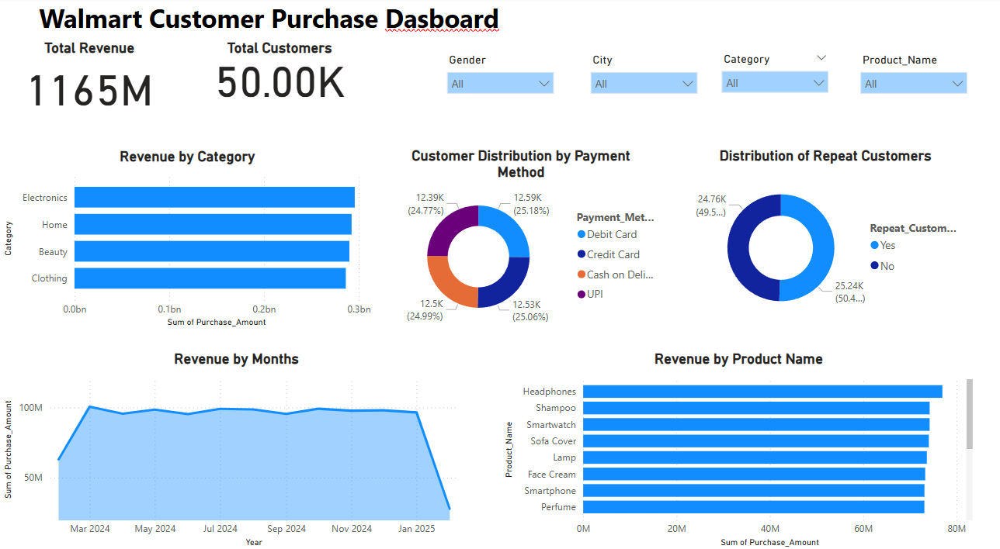

# Project Background

Walmart adalah perusahaan ritel multinasional Amerika yang mengoperasikan jaringan hypermarket, department store, dan toko kelontong di Amerika Serikat dan 23 negara lainnya.

Dalam industri ritel, fluktuasi penjualan berdasarkan waktu, lokasi, dan produk dapat memberikan wawasan penting untuk mengoptimalkan strategi bisnis. Oleh karena itu, analisis data penjualan Walmart dilakukan untuk mengidentifikasi pola penjualan dan dapat meningkatkan kesuksesan dalam penjualan.

**Tujuan Project :**
1. **Product Performance Analysis**: Mengidentifikasi kategori produk mana yang memberikan kontribusi pendapatan terbesar serta produk mana yang
memiliki performa terendah.
2. **Impact of Discounts**: Mengevaluasi apakah penerapan diskon benar-benar meningkatkan pendapatan.
3. **Regional Sales Analysis**: Mengetahui kota mana yang memberikan pendapatan tertinggi bagi perusahaan, sebagai dasar untuk pengambilan
keputusan distribusi dan ekspansi.
4. **Customer Analysis**: Menelusuri faktor-faktor yang memengaruhi pelanggan untuk kembali melakukan pembelian

# Data Structure
Dataset yang digunakan dalam analisis ini diperoleh dari Kaggle dan dapat diakses melakui tautan berikut: [Walmart Customer Purchase Behavior Dataset](https://www.kaggle.com/datasets/logiccraftbyhimanshi/walmart-customer-purchase-behavior-dataset)

### Penjelasan mengenai kolom pada dataset:
| Nama Kolom         | Deskripsi                                                                 |
|--------------------|---------------------------------------------------------------------------|
| `Customer_ID`      | Unique identifier untuk setiap pelanggan.                                 |
| `Age`              | Usia pelanggan.                                                           |
| `Gender`           | Jenis kelamin pelanggan (Male/Female/Other).                             |
| `City`             | Kota tempat pembelian dilakukan.                                          |
| `Category`         | Kategori produk (misalnya: Electronics, Clothing, Groceries).             |
| `Product_Name`     | Nama produk yang dibeli.                                                  |
| `Purchase_Date`    | Tanggal pembelian.                                                        |
| `Purchase_Amount`  | Total jumlah uang yang dibelanjakan.                                     |
| `Payment_Method`   | Metode pembayaran (Credit Card, Cash, Digital Wallet, dll.).              |
| `Discount_Applied` | Apakah diskon diterapkan pada pembelian (Yes/No).                        |
| `Rating`           | Rating dari pelanggan terhadap pembelian (skala 1–5).                     |
| `Repeat_Customer`  | Menunjukkan apakah pelanggan pernah membeli sebelumnya (Yes/No).          |

# Summary
